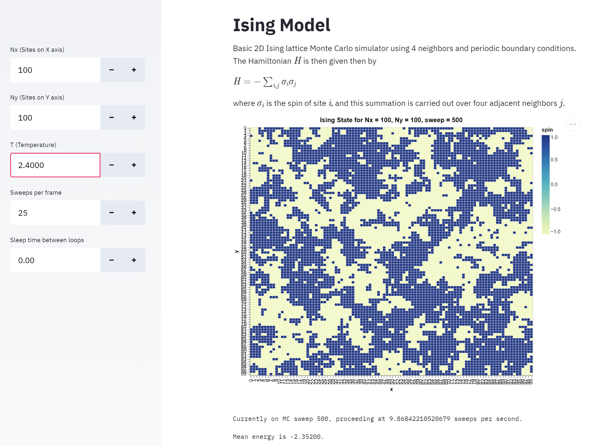

# streamlit-ising-model

Basic 2D Ising model simulation with no external field, with some basic controls for system size and temperature.  Frontend provided via streamlit, running the Ising model in a continuous loop.  Maybe someone will find this useful as a teaching model letting students play with system size and temperature to observe the Ising phase transition.

## Installation
Install via provided Makefile.

For more details, consult the documentation for [streamlit](https://docs.streamlit.io/en/stable/).
